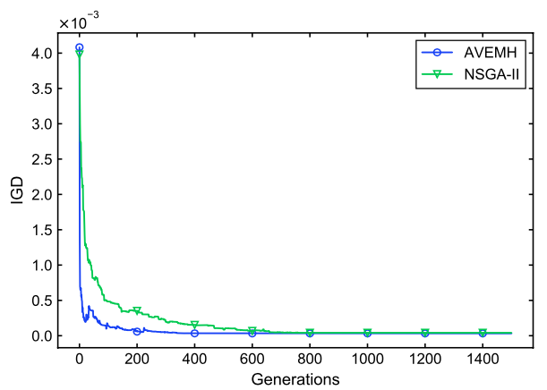
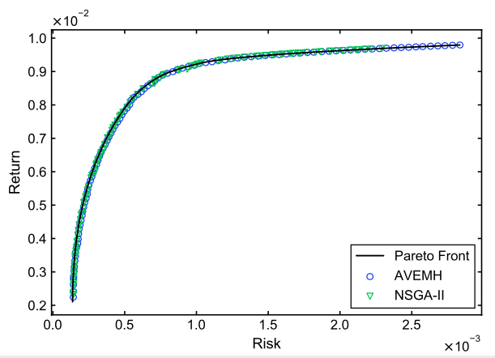

# [WIP] Portfolio optimisation with AVEMH and NSGA-II

## AVEMH

Adaptive Vector Multiobjective Heuristics is... (wip)

## NSGA-II

NSGA-II is one of the most popular multi objective optimization algorithms with three special characteristics, fast non-dominated sorting approach, fast crowded distance estimation procedure and simple crowded comparison operator

## Instances

There are currently 5 data files of [OR-Library](http://people.brunel.ac.uk/~mastjjb/jeb/orlib/portinfo.html).

These data files are the test problems used in the paper:
Chang, T.-J., Meade, N., Beasley, J.E. and Sharaiha, Y.M.,
"Heuristics for cardinality constrained portfolio optimisation"
Comp. & Opns. Res. 27 (2000) 1271-1302.

The test problems are the files:
port1, port2, ..., port5

The format of these data files is:
number of assets (N)
for each asset i (i=1,...,N):
mean return, standard deviation of return
for all possible pairs of assets:
i, j, correlation between asset i and asset j

The unconstrained efficient frontiers for each of these
data sets are available in the files:
portef1, portef2, ..., portef5

The format of these files is:
for each of the calculated points on the unconstrained frontier:
mean return, variance of return

## Python version and libraries

- Python 3.7.4 are used in the experiments.
- Check alias for python3 and edit `.sh` files. (If the alias is `python3`, change `python` to `python3`. **A better way is to use `pyenv` and set `pyenv global 3.7.4`.**)
- Following libraries are required,
  - numpy
  - scipy
  - pandas
  - matplotlib
  - seaborn

## How to use

1. Open terminal
2. Run `run.sh`
3. Program will create a folder named `tmp` and save simulation results in this folder
4. Enter `process_script`
5. Run file `run.sh` in `process_script` folder
6. Program will create `images`, `num_res` and `report` folders, containing images, metrics and statistical issues, respectively.

## Images

### Disclamer

One more analysis of new approach used in portfolio optimization. Others can be [found here](https://www.scielo.br/scielo.php?script=sci_arttext&pid=S0103-65132020000100404&tlng=en#c01)

This program was largely inspired by the project [Solving Portfolio Optimization Problems Using MOEA / D and Lévy Flight](https://github.com/Y1fanHE/po_with_moead-levy)
